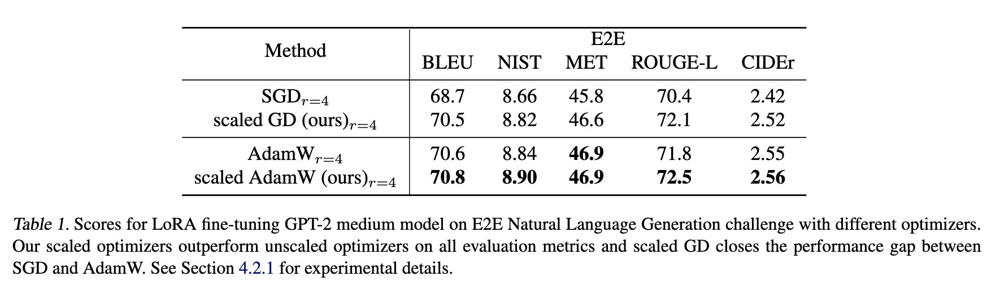

# GPT-2 experiments for Riemannian LoRA


**Riemannian Preconditioned LoRA for Fine-Tuning Foundation Models** <br>
*Fangzhao Zhang, Mert Pilanci* <br>
Paper: XXX <br>

This repository builds on original LoRA project [LoRA (Hu et al., 2021)](https://arxiv.org/abs/2106.09685) 
<p>

</p>

We also evaluate for varying LoRA ranks, different model sizes, and different datasets inclong DART and WebNLG. Here we demonstrate our experiment for E2E datasets and training loss plot (Figure 1 in the original paper). See the [LoRA](https://github.com/microsoft/LoRA/tree/main) repository for expeirments for other datasets.

## Repository Overview

* [src/](examples/NLG/src) contains the source code used for data processing, training, and decoding.
* [eval/](examples/NLG/eval) contains the code for task-specific evaluation scripts.
* [data/](examples/NLG/data) contains the raw data we used in our experiments.
* [vocab/](examples/NLG/vocab) contains the GPT-2 vocabulary files.

## Requirements
See the [LoRA](https://github.com/microsoft/LoRA/tree/main) repository for requirements.

## Quickstart

1. Clone the repo and run the following command
 ```
cd examples/NLG
 pip install -r requirement.txt
 bash download_pretrained_checkpoints.sh
 bash create_datasets.sh
 cd ./eval
 bash download_evalscript.sh
 cd ..
 ```


## E2E Experiment
1.  Enter experiment folder
```
cd examples/NLG
```

2. Train GPT-2 Medium with scaled AdamW optimizer (see our paper for hyperparameters)
```
python -m torch.distributed.launch --nproc_per_node=1 src/gpt2_ft.py \
    --train_data ./data/e2e/train.jsonl \
    --valid_data ./data/e2e/valid.jsonl \
    --train_batch_size 8 \
    --grad_acc 1 \
    --valid_batch_size 4 \
    --seq_len 512 \
    --model_card gpt2.md \
    --init_checkpoint ./pretrained_checkpoints/gpt2-medium-pytorch_model.bin \
    --platform local \
    --clip 0.0 \
    --lr 0.0002 \
    --weight_decay 0.01 \
    --correct_bias \
    --adam_beta2 0.999 \
    --scheduler linear \
    --warmup_step 500 \
    --max_epoch 5 \
    --save_interval 1000 \
    --lora_dim 4 \
    --lora_alpha 32 \
    --lora_dropout 0.1 \
    --label_smooth 0.1 \
    --work_dir ./trained_models/GPT2_M/e2e \
    --random_seed 110 \
    --trial_name E2E_experiment\
    --opt scaled_adamw
```
Here <code>sgd, scaled_gd, adamw, scaled_adamw</code> are all valid choices for <code>--opt</code>.

2. Generate output
```
python -m torch.distributed.launch --nproc_per_node=1 src/gpt2_beam.py \
    --data ./data/e2e/test.jsonl \
    --batch_size 1 \
    --seq_len 512 \
    --eval_len 64 \
    --model_card gpt2.md \
    --init_checkpoint ./trained_models/GPT2_M/e2e/model_E2E_experiment.26290.pt \
    --platform local \
    --lora_dim 4 \
    --lora_alpha 32 \
    --beam 10 \
    --length_penalty 0.8 \
    --no_repeat_ngram_size 4 \
    --repetition_penalty 1.0 \
    --eos_token_id 628 \
    --work_dir ./trained_models/GPT2_M/e2e \
    --output_file predict_E2E_experiment.jsonl
```
3. Decode outputs from step (2)
```
python src/gpt2_decode.py \
    --vocab ./vocab \
    --sample_file ./trained_models/GPT2_M/e2e/predict.26289.b10p08r4.jsonl \
    --input_file ./data/e2e/test_formatted.jsonl \
    --output_ref_file e2e_ref.txt \
    --output_pred_file e2e_pred.txt
```

4. Run evaluation on E2E test set
```
python eval/e2e/measure_scores.py e2e_ref.txt e2e_pred.txt -p
```

## Trainning Loss Experiment

Figure 1 in the paper can be generated by 
```
sh examples/NLG/loss_curve.sh
```
