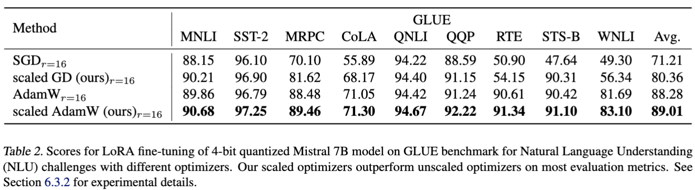

# Mistral 7B Experiments for Riemannian LoRA


**Riemannian Preconditioned LoRA for Fine-Tuning Foundation Models** <br>
*Fangzhao Zhang, Mert Pilanci* <br>
Paper: [https://arxiv.org/abs/2402.02347](https://arxiv.org/abs/2402.02347) <br>

<p>

</p>

## Repository Overview
* [mistral/](mistral) contains the source code used for optimizers and trainer which builds on HuggingFace Transformers trainer class.
* [mistral_glue.py](mistral_glue.py) contains main training code.

## Requirements
Install all required dependencies by
```bash
 pip install -r requirement.txt
 ```

## Training and Evaluating
 Run the following code
 ```bash
python mistral_glue.py --optimizer scaled_adamw --optimizer_reg 4.5  --lr 5e-5  --task rte
 ```
Here <code>sgd, scaled_gd, adamw, scaled_adamw</code> are all valid choices for <code>--optimizer</code>. <code>--optimizer_reg</code> sets regularization parameter in Riemannian preconditioner.

## Parameter Reference
| Task  | adamw lr  | scaled_adamw lr  | sgd lr  | scaled_gd lr  | scaled_adamw reg | scaled_gd reg |
| ------------- | ------------- | ------------- |  ------------- | ------------- | ------------- | ------------- |
| rte  | 5e-5 | 5e-5 |  5e-3 | 5e-3 | 4.5 | 0.5 |
| cola  | 5e-5  | 5e-5 |  5e-3 | 5e-3 | 1.1e-2 | 0.1 |
| sst2 | 5e-5  | 5e-5 |  5e-3 | 5e-3 | 0.9 | 1e-2 |
| stsb  | 5e-5  | 5e-5 |  5e-3 | 5e-3 | 1e-2 | 1e-2 |
| mrpc  | 5e-5  | 5e-5 |  5e-3 | 5e-3 | 100 | 1e-2 |
| wnli  | 5e-5 | 5e-5 |  5e-3 | 5e-3| 10 | 1e-6 |
| qnli  | 1e-5 | 1e-5 |  5e-3 | 9e-4 | 1e-6 | 1e-2 |
| mnli  | 5e-6 | 3e-5 |  5e-3 | 1e-3 | 1e-6 | 1e-2 |
| qqp  | 5e-6 | 3e-5 |  5e-3 | 4e-3 | 1e-6 | 1e-2|

