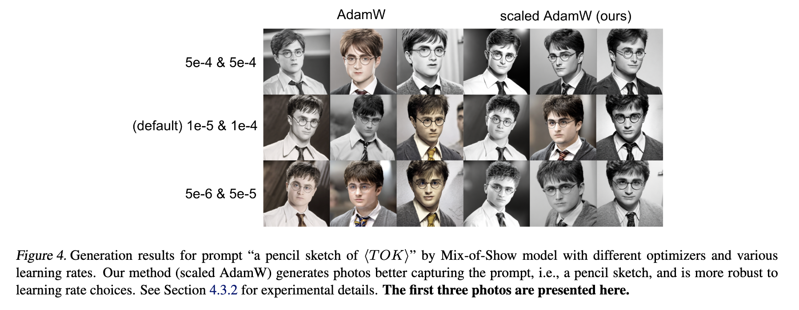

# Mix-of-Show Experiments for Riemannian LoRA


**Riemannian Preconditioned LoRA for Fine-Tuning Foundation Models** <br>
*Fangzhao Zhang, Mert Pilanci* <br>
Paper: [https://arxiv.org/abs/2402.02347](https://arxiv.org/abs/2402.02347) <br>

This repository builds on original Mix-of-Show project [Mix-of-Show (Gu et al., 2023)](https://arxiv.org/abs/2305.18292).

<p>

</p>


We also test with Hermoine character and with SGD, scaled GD optimizers. 

## Repository Overview

* [datasets/](datasets) contains the training images.
* [mixofshow/](mixofshow) contains the source code used for models.
* [options/](options) contains training and testing hyperparameters.

## Requirements
```bash
pip install -r requirements.txt
 ```
See the [Mix-of-Show](https://github.com/TencentARC/Mix-of-Show/tree/main) repository for requirement details.

## Quickstart
1. Download pretrained model
 ```bash
mkdir experiments
mkdir experiments/pretrained_models
cd experiments/pretrained_models
git-lfs clone https://huggingface.co/windwhinny/chilloutmix.git
 ```
2. Create model directory
```bash
cd ../..    
mkdir experiments/8101_EDLoRA_potter_Cmix_B4_Repeat500
mkdir experiments/8101_EDLoRA_potter_Cmix_B4_Repeat500/models
 ```
3. Train (specify learning rates in <code>-opt</code> files)
```bash
accelerate launch train_edlora.py -opt options/train/EDLoRA/real/8101_EDLoRA_potter_Cmix_B4_Repeat500.yml --optimizer scaled_adamw --optimizer_reg 0
```

Here <code>sgd, scaled_gd, adamw, scaled_adamw</code> are all valid choices for <code>--optimizer</code>. Scaled AdamW is set as dafualt. Trained models will be saved to <code>experiments/8101_EDLoRA_potter_Cmix_B4_Repeat500/models</code>.

4. Create image directory
```bash
mkdir results
mkdir results/8101_EDLoRA_potter_Cmix_B4_Repeat500
 ```

5. Test
```bash
python test_edlora.py -opt options/test/EDLoRA/human/8101_EDLoRA_potter_Cmix_B4_Repeat500.yml
```
Figures will be saved to <code>results/8101_EDLoRA_potter_Cmix_B4_Repeat500/visualization</code>.


## Parameter Reference

| Learning Rate | scaled_adamw reg | LoRA fusion parameter
| ------------- | ------------- | ------------- |
| 5e-4 & 5e-4 | 10 | 0.7 |
| 1e-5 & 1e-4 | 0 | 1 |
| 5e-6 & 5e-5 | 0 | 1 |


