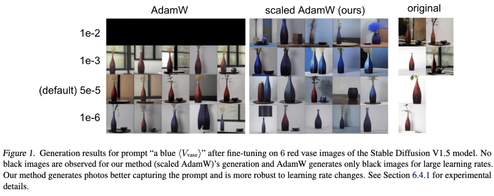

# Object Genration Experiments for Riemannian LoRA

**Riemannian Preconditioned LoRA for Fine-Tuning Foundation Models** <br>
*Fangzhao Zhang, Mert Pilanci* <br>
Paper: [https://arxiv.org/abs/2402.02347](https://arxiv.org/abs/2402.02347) <br>

This repository builds on the [custom diffsuon](https://github.com/cloneofsimo/lora)  project. 

<p>

</p>

We also generate figures with target objects chair and dog, with training images stored in [contents/](contents).

## Repository Overview
* [contents/](contents) contains the training images of different objects.
* [lora_diffusion/](lora_diffusion) contains the code for lora fine-tuning custom-diffusion model.
* [training_scripts/](training_scripts) contains scripts code for training and testing.

## Requirements
See the [custom diffsuon](https://github.com/cloneofsimo/lora) repository for requirements.
```
pip install -r requirements.txt
 ```

## Training
```bash
cd training_scripts
sh run_lora_db_w_text.sh scaled_adamw
 ```
Here <code>sgd, scaled_gd, adamw, scaled_adamw</code> are all valid choices for command line arguments, which specify the optimizer to be used. Learning rates and training objects can also be modified in <code>run_lora_db_w_text.sh</code> file. The tuned model path is stored in <code>OUTPUT_DIR</code> in <code>run_lora_db_w_text.sh</code> file.

## Testing
```bash
python test.py
 ```
where <code>OUTPUT_DIR</code> and image directories should be provided in <code>test.py</code> file.
