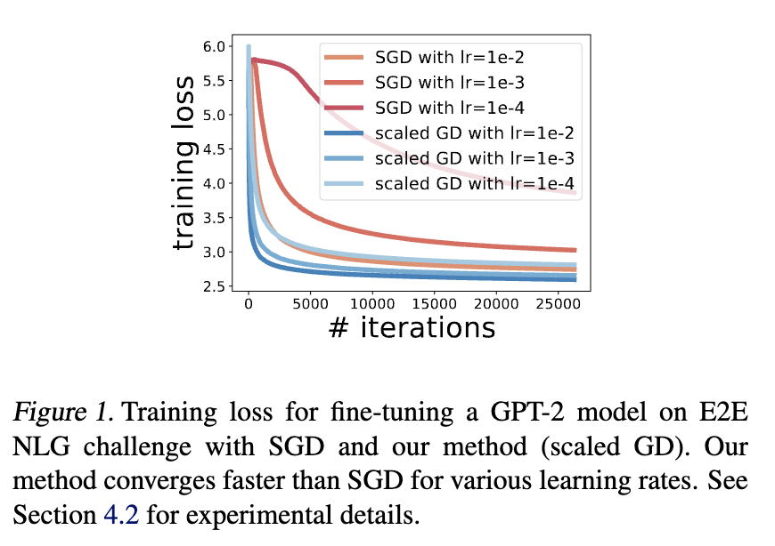
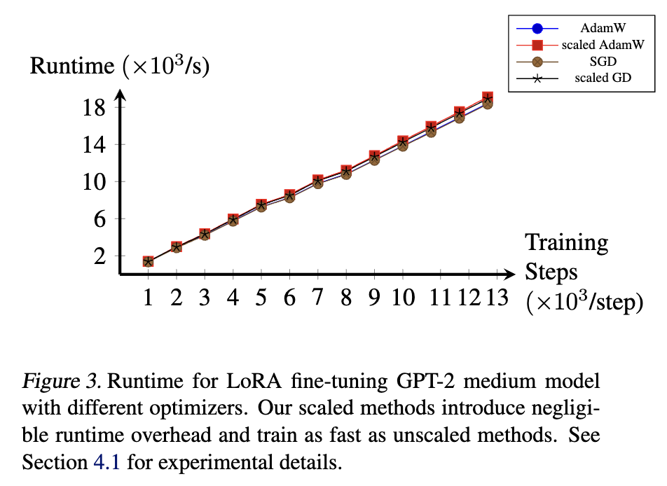
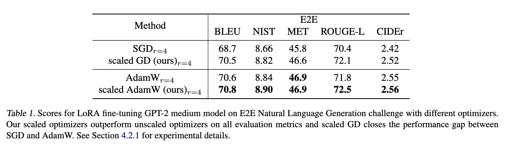
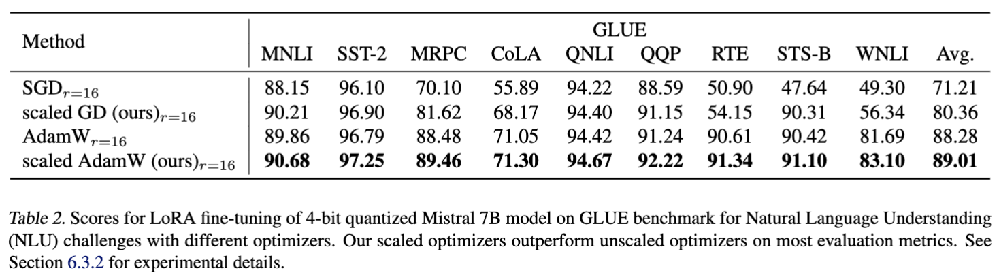
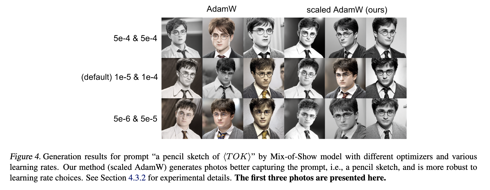
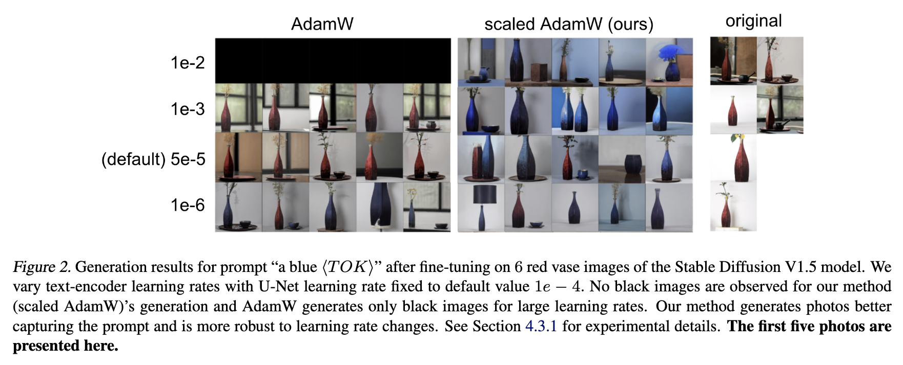

# Riemannian Preconditioned LoRA for Fine-Tuning Foundation Models

This repo contains the source code for experiments for our paper


**Riemannian Preconditioned LoRA for Fine-Tuning Foundation Models** <br>
*Fangzhao Zhang, Mert Pilanci* <br>
Paper: XXX <br>

In this work we study the enhancement of Low Rank Adaptation (LoRA) fine-tuning procedure by introducing a Riemannian preconditioner in its optimization step. Specifically, we introduce an $r\times r$ preconditioner in each gradient step where $r$ is the LoRA rank. This preconditioner requires a small change to existing optimizer code and creates virtually minuscule storage and runtime overhead. Our experimental results with both large language models and text-to-image diffusion models show that with our preconditioner, the convergence and reliability of SGD and AdamW can be significantly enhanced. Moreover, the training process becomes much more robust to hyperparameter choices such as  learning rate. Theoretically, we show that fine-tuning a two-layer ReLU network in the convex paramaterization with our preconditioner has convergence rate independent of condition number of the data matrix. This new Riemannian preconditioner, previously explored in classic low-rank matrix recovery, is introduced to deep learning tasks for the first time in our work. 

Specifically, in each iteration, let $W$ denotes the pretrained model weights, and let $(A,B)$ denotes LoRA parameter in the current iteration, we consider the following scaled GD updating rule
<h3 align="center">$A = A-\eta \nabla_A f (B^TB)^{-1}$</h3>
<h3 align="center">$B = B-\eta \nabla_B f (A^TA)^{-1}$</h3>

where $A^TA$ and $B^TB$ are of dimension $r$ by $r$. This preconditioner has originally been studied by [Tong et al.](https://arxiv.org/abs/2010.13364), [Jia et al.](https://openreview.net/pdf?id=rLpLjCBW4J), and some other works for classic low rank matrix optimization problems and has been shown to have better global convergence rate compared to plain gradient method. Here we extend it to AdamW method and introduce it to LoRA fine-tuninng procedure. The following plots show that the above preconditioner enhances LoRA training significantly without introducing much runtime overhead.

<p align='center'>
 
</p>

All figures in our original paper can be generated from the current repository with hyperparameters correctly chosen according to the paper XXX.

## Repository Overview
In this project, we experiments with GPT-2 fine-tuning, Mistral 7B fine-tuning, Mix-of-Show fine-tuning, custom diffusion fine-tuning.
1. GPT-2 Fine-Tuning (see [GPT-2/](GPT-2) for experiment code.)
<p align='center'>

</p>


2. Mistral 7B Fine-Tuning (see [Mistral-7B/](Mistral-7B) for experiment code.)
<p align='center'>

</p>

3. Mix-of-Show Fine-Tuning (see [Mix-of-Show/](Mix-of-Show) for experiment code.)
<p align='center'>

</p>


4. Custom Diffusion Fine-tuning (see [Object_Genration/](Object_Genration) for experiment code.)
<p align='center'>

</p>


## Contact
Please contact us or post an issue if you have any questions.
* Fangzhao Zhang (zfzhao@stanford.edu)

## References and Acknowledgements
This work has been heavily influenced by recent development in low-rank matrix optimization research and parameter-efficient fine-tuning (PEFT) research. We just combine them together. We cite several important references here with a more complete reference list presented in our paper XXX. Moreover, our experiment code is mainly built on the following repositories: [LoRA (Hu et al., 2021)](https://arxiv.org/abs/2106.09685), [Mix-of-Show (Gu et al., 2023)](https://arxiv.org/abs/2305.18292), [custom diffsuon](https://github.com/cloneofsimo/lora).

```BibTeX
@article{tong2021accelerating,
    title={Accelerating Ill-Conditioned Low-Rank Matrix Estimation via Scaled Gradient Descent},
    author={Tian Tong and Cong Ma and Yuejie Chi},
    journal={arXiv preprint arXiv:2005.08898},
    year={2021}
}
```

```BibTeX
@inproceedings{hu2022lora,
title={Lo{RA}: Low-Rank Adaptation of Large Language Models},
author={Edward J Hu and Yelong Shen and Phillip Wallis and Zeyuan Allen-Zhu and Yuanzhi Li and Shean Wang and Lu Wang and Weizhu Chen},
booktitle={International Conference on Learning Representations},
year={2022},
url={https://openreview.net/forum?id=nZeVKeeFYf9}
}
```

```BibTeX
@article{gu2023mixofshow,
    title={Mix-of-Show: Decentralized Low-Rank Adaptation for Multi-Concept Customization of Diffusion Models},
    author={Gu, Yuchao and Wang, Xintao and Wu, Jay Zhangjie and Shi, Yujun and Chen Yunpeng and Fan, Zihan and Xiao, Wuyou and Zhao, Rui and Chang, Shuning and Wu, Weijia and Ge, Yixiao and Shan Ying and Shou, Mike Zheng},
    journal={arXiv preprint arXiv:2305.18292},
    year={2023}
}
```


## Citation
```BibTeX
@inproceedings{
XXX
}
```
